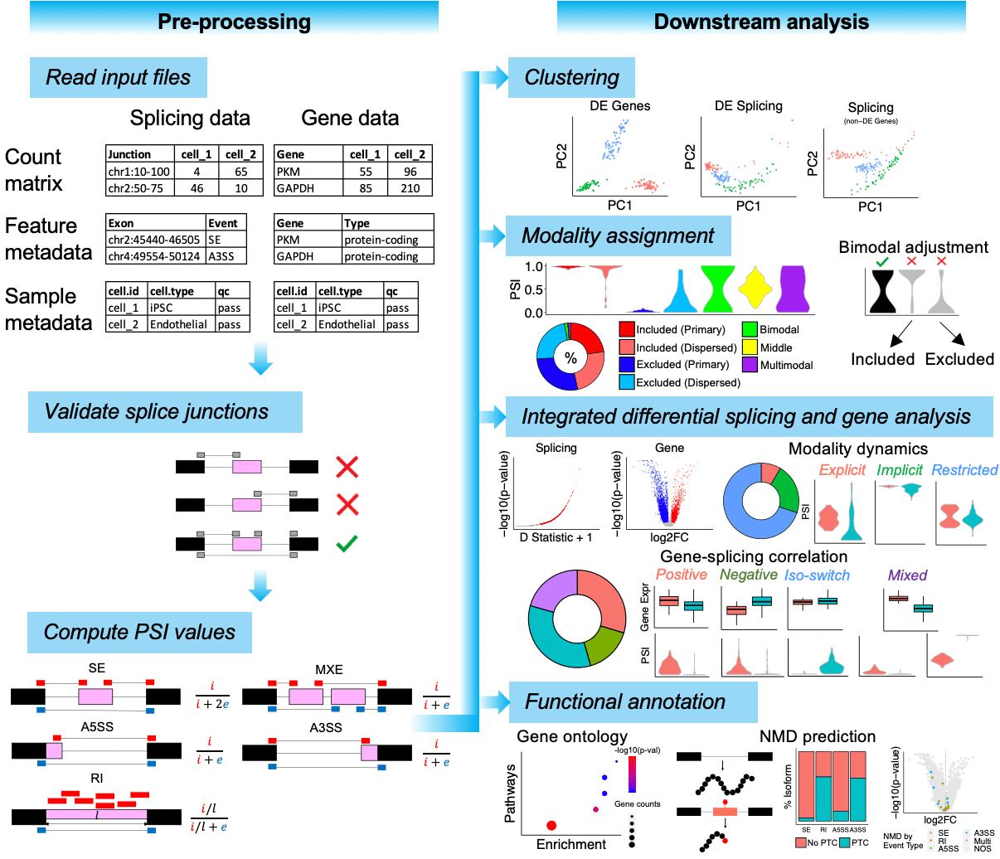

# MARVEL
MARVEL is an R package developed for alternative splicing analysis at single-cell resolution. MARVEL complements published single-cell splicing softwares with the following features:
1. Percent spliced-in (PSI) quantification for all seven main exon-level splicing events, i.e. skipped-exon (SE), mutually-exclusive exons (MXE), retained-intron (RI), alternative 5' and 3' splice sites (A5SS, A3SS), and alternative first and last exons (AFE, ALE).
2. Stratify PSI distribution for each splicing event into the modalities (discrete splicing patterns), and adjust for technical biases during this assignment.
3. Integrated differential splicing and gene expression analysis to reveal gene-splicing dynamics.
4. Dimension reduction analysis.
5. Pathway enrichment analysis.
6. Splicing-associated nonsense-mediated decay (NMD) prediction.
7. Multiple visualisation functions for exploring splicing and gene expression across cell populations.
8. Supports both plate-based (e.g., Smart-seq2) and droplet-based (e.g., 10x Genomics) single-cell RNA-sequencing data analysis. 
9. In principle, also applicable to bulk RNA-sequencing data analysis.

# General workflow



# Installation
Please install the following pre-requisite R packages from CRAN prior to installing MARVEL.
```
install.packages("ggplot2")
install.packages("Matrix")
install.packages("plyr")
install.packages("scales")
```

MARVEL is available on CRAN.
```
install.packages("MARVEL")
library(MARVEL)
```

Alternatively and highly recommended, MARVEL may be installed from Github, which includes the most up-to-date functionalities.
```
library(devtools)
install_github("wenweixiong/MARVEL")
library(MARVEL)
```

# Install adjunct Bioconductor packages
The following packages are not mandatory for MARVEL installation, but are highly recommended to support the functionalities of MARVEL.
```
if (!requireNamespace("BiocManager", quietly = TRUE))
    install.packages("BiocManager")

BiocManager::install("AnnotationDbi")
BiocManager::install("Biostrings")
BiocManager::install("BSgenome")
BiocManager::install("BSgenome.Hsapiens.NCBI.GRCh38")
BiocManager::install("clusterProfiler")
BiocManager::install("GenomicRanges")
BiocManager::install("IRanges")
BiocManager::install("org.Hs.eg.db")
BiocManager::install("org.Mm.eg.db")
BiocManager::install("phastCons100way.UCSC.hg38")
```
 
# Install adjunct CRAN packages
The following packages are not mandatory for MARVEL installation, but are highly recommended to support the functionalities of MARVEL.
```
install.packages("factoextra")
install.packages("FactoMineR")
install.packages("fitdistrplus")
install.packages("ggplot2")
install.packages("ggrepel")
install.packages("gtools")
install.packages("kSamples")
install.packages("pheatmap")
install.packages("reshape2")
install.packages("S4Vectors")
install.packages("scales")
install.packages("stringr")
install.packages("textclean")
install.packages("twosamples")
```

# Install adjunct customised package
Please install the modified wiggleplotr R package from here: https://drive.google.com/file/d/1eEkq1axQXynVifWanh9ACichIrJjyNfr/view?usp=share_link
```
install.packages("wiggleplotr_1.18.0.tar.gz", repos=NULL, type="source")
```

# Tutorial
Single-cell plate-based alternative splicing analysis: https://wenweixiong.github.io/MARVEL_Plate.html  
Single-cell droplet-based alternative splicing analysis: https://wenweixiong.github.io/MARVEL_Droplet.html

# Version updates
version 2.0.5
- PCA/UMAP coordinates now included in output for gene and combined gene-splicing based dimension reduction analysis with **RunPCA** function.

version 2.0.4
- Included **Preprocess_rMATS** function to convert rMATS splicing coordinates as input for MARVEL. Please see *Splicing event metadata* section of the plate-based tutorial (https://wenweixiong.github.io/MARVEL_Plate.html).
- Included **PrepareBedFile.RI** function to retrieve intron coordinates for retained intron (RI) splicing events in BED format as input for bedtools to compute intron coverage. Please see *Intron count matrix* section of the plate-based tutorial.
- Example script and data to execute both functions above available here: https://drive.google.com/file/d/1ilhgUdRQYC2ee1fbA54ZdxbbtB8tlQ2m/view?usp=sharing
- Additional scripts for computing intron counts using BEDTools after running **PrepareBedFile.RI**, and scripts to tabulate intron counts after running BEDTools available here: https://drive.google.com/file/d/13YMkDg_oE3fD7jYyQna2QFlDltxxxRYW/view?usp=sharing . Please see *Intron count matrix* section of the plate-based tutorial.

version 2.0.3
- Updated **RunPCA** function to enable a Bayesian approach for imputing missing PSI values prior to dimension reduction with principal component analysis (PCA). To use this approach for PCA, simply specify  *method.impute="Bayesian"* and *level="splicing"*. This approach was inspired by Benegas *et al.* (https://elifesciences.org/articles/73520) and please cite his work if you use this option. Note that the **ComputePSI.Posterior** function would need to be executed before running the **RunPCA** function. Currently, missing PSI values are imputed with random values between 0-100 with the *method.impute="random"*. This function is only applicable for plate-based data.
- Updated *CompareValues* function to enable setting the random number generator when using DTS for differential splicing analysis. This will ensure reproducibility of differential splicing results. Simply specify *seed.dts=1* (or any numeric value) together with *method="dts"*. Currently, and by default, the seed is not set when DTS is used. This function is only applicable for plate-based data.

version 2.0.2
- Updated **AnnotateSJ.10x** function to enable handling of GTF with chr prefix. Previously, only handled GTF without chr prefix. This function is only applicable for droplet-based data.

version 2.0.1
- Updated **AnnotateGenes.10x** function to enable handling of GTF with either gene_type or gene_biotype attribute label. Previously, only handled GTF with gene_biotype attribute label. This function is only applicable for droplet-based data.
- Updated **ValidateSJ.10x**  function to enable filtering in of novel splice junctions. A novel splice junction is defined as one end mapping to a known exon while the other end mapping to a novel/unknown exon. Simply include the argument *keep.novel.sj=TRUE* (default is *FALSE*) to retain novel splice junctions for downsteam analysis. Novel splice junctions may be of specifically expressed in a particular disease or hitherto unreported splice junctions expressed in a particular tissue or cell type. Previously, only splice junctions with both ends mapping to known exons were retained while novel splice junctions were filtered out. This function is only applicable for droplet-based data.
- Included **SubsetCrypticSS** function to enable filtering in of cryptic A5SS and A3SS for the list of pre-defined A5SS and A3SS splicing events provided by the user (e.g., rMATS). A cryptic A5SS or A3SS is defined as novel splice site located within 100bp of the canonical splice site. Simply specify *EventType=="A5SS"* and then execute the same function with *EventType=="A3SS"* argument. Distance between novel and canonical splice sites may be specified using the *DistanceToCanonical* argument (default is 100). This function should be executed after creating the MARVEL object with the **CreateMarvelObject** function. This function is only applicable for plate-based data.
- Included **RemoveCrypticSS** function to enable filtering out of cryptic A5SS and A3SS for the list of AFE and ALE splicing events detected by MARVEL, respectively.  Simply specify *EventType=="AFE"* and then execute the same function with *EventType=="ALE"* argument. This function should be executed after detecting AFE and ALE using the **DetectEvents** function. This function is only applicable for plate-based data.

version 1.4.0
- First version uploaded on CRAN

# Further improvements
We are keen to further improve MARVEL to make it more comprehensive for single-cell splicing analysis. In particular we hope to include more functionalites related to functional annotation, e.g., predicting the biological consequence of alternative splicing. If interested please get in touch :)

# Contact
Sean Wen <sean.wen@astrazeneca.com>. 
