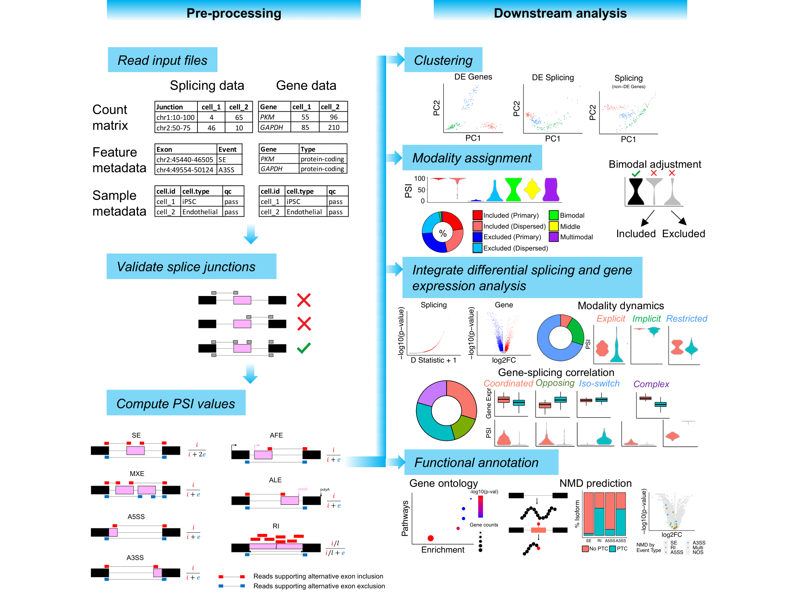

# MARVEL
MARVEL is an R package developed for alternative splicing analysis at single-cell resolution. Compared to existing single-cell alternative splicing analysis softwares such as BRIE and Expedition, MARVEL provides additional functionalities:
1. Compute PSI values for all five main exon-level splicing events, i.e. skipped-exon (SE), mutually-exclusive exons (MXE), retained-intron (RI), alternative 5' splice site (A5SS), and alternative 3' splice site (A3SS).
2. Stratify PSI distribution for each splicing event into the five main modalities, i.e. included, excluded, bimodal, middle, and multimodal. Further stratify included and excluded into primary and dispersed sub-modalities. 
3. Modality of bimodal category are further screened for false bimodal modality.
4. Perform integrated differential splicing and gene expression analysis to reveal gene-splicing dynamics.
5. Functional annotation of differentially spliced genes, namely gene ontology and splicing-associated nonsense-mediated decay (NMD) prediction.
6. Supports both plate- and droplet-based single-cell data.

MARVEL supports single-cell alternative splicing analysis for single-cell RNAseq data generated from plate-based (e.g. Smart-seq2) and droplet-based (10x Genomics) platforms.

# Workflow for plate-based splicing analysis


# Installation
Please install the following pre-requisite R package from Bioconductor before installing MARVEL.
```
# Install required Bioconductor packages
if (!requireNamespace("BiocManager", quietly = TRUE))
    install.packages("BiocManager")

BiocManager::install("AnnotationDbi")
BiocManager::install("Biostrings")
BiocManager::install("BSgenome")
BiocManager::install("BSgenome.Hsapiens.NCBI.GRCh38")
BiocManager::install("GenomicRanges")
BiocManager::install("GenomicScores")
BiocManager::install("GO.db")
BiocManager::install("GOstats")
BiocManager::install("org.Hs.eg.db")
BiocManager::install("phastCons100way.UCSC.hg38)
```

For the latest updates, including features in beta (testing) mode, please install MARVEL from Github.
```
# Install MARVEL package
library(devtools)
install_github("wenweixiong/MARVEL")

# Load package
library(MARVEL)
```

For CRAN-curated version of the package, please install MARVEL from CRAN.
```
# Install MARVEL package
install.packages("MARVEL")

# Load package
library(MARVEL)
```

# Tutorial
Single-cell plate-based alternative splicing analysis can be found here: https://wenweixiong.github.io/MARVEL_Plate.html

# Preprint
